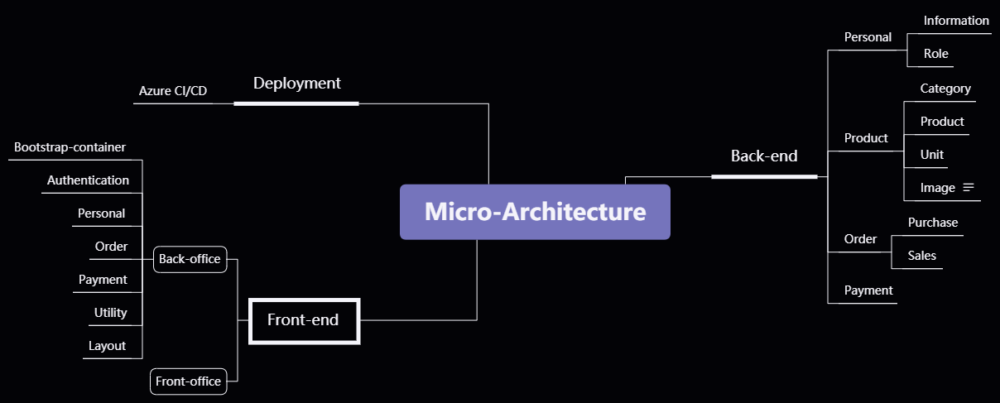

# Micro-architecture

## Business Architecture



## Technical stack

### Backend
- .NET 5
### Frontend
- ReactJS typescript

## Installation
1. Install Docker ( if not install before ).
2. Download project from github ( [https://github.com/hoaint235/micro-architecture](https://github.com/hoaint235/micro-architecture) )
3. Go to file hosts in windows to add config with ip of your network, example:
```
192.168.1.1 micro-portal 
```
3. Extract files.
4. Open deployment folder
5. Run command line to install softwares in project
```
docker-compose -f docker-compose-software.yml up
```
6. Run command line to build and run services backend
```
docker-compose -f docker-compose-backend.yml build
docker-compose -f docker-compose-backend.yml run
```
7. Run command line to build and run frontend
```
docker-compose -f docker-compose-frontend.yml build backoffice
docker-compose -f docker-compose-frontend.yml run backoffice
```
8. Open any browser and type [http://micro-portal-docker:9000](http://micro-portal-docker:9000)